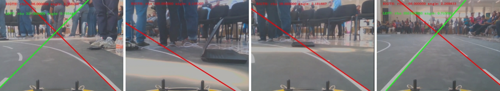
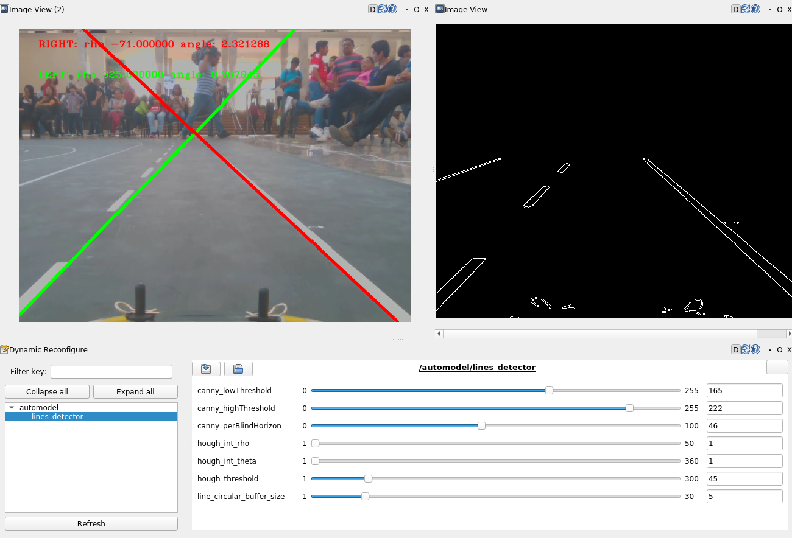

# Automodel line detector



## Overview
The AutoModelCar challenge in the Robotics Mexican Tournament (TMR), accelerates innovation in autonomous systems by advancing perception, planning, and control algorithms for self-driving vehicles. Participants develop solutions using 1:10 scale robotic cars equipped with sensor and actuator configurations mirroring real-world automotive systems.

This category evolved from the "Urban Mobility Visions" initiative spearheaded by [Dr. Raul Rojas at Freie Universität Berlin](https://www.fu-berlin.de/en/presse/informationen/fup/2016/fup_16_271-autonome-modellautos-universitaet-mexiko/index.html).

This repository provides of a ROS prototype line detector that outputs vital positional data to maintain autonomous vehicles within a lane.


## 📦 Nodes
1. **video_publisher**
   
   Reads a video file and publish its frames sequencially.
   - Published topic:
     - */video_publisher/video_path*
     The current frame in a  *sensor_msgs::ImagePtr* message
   - Parameter:
     - *video_path*

       The video file path with the sequence to analyise

     - *loop*

       If true, the video stream loops.

   - Usage:
    
      Start the ROS enviroment with *roscore* an in a different terminal run
      ```bash 
      rosrun video_publisher video_publisher_node _video_path:=[VIDEO_FILE]
      ```

2. **automodel_line_detector**

   Having a point of view (POV) frame, determines de left and right lines that marks the limits of a lane.
   - Published topic:
     - */automodel/line_detector/left*

       The detected left line  *sensor_msgs::ImagePtr* message

     - */automodel/line_detector/right*

       The detected right line  *sensor_msgs::ImagePtr* message

   - Parameter:

     The parameters intialization is set in the *config/config.yaml* file

     - */automodel/line_detector/image_topic*
     
       Determines de topic that is providing with the sequence of frames to analyze


     - */automodel/line_detector/canny_lowThreshold* and */automodel/line_detector/canny_highThreshold*
       
       Indicates the low and high thresholds used in the [canny edge detector](https://ieeexplore.ieee.org/abstract/document/4767851)


     - */automodel/line_detector/canny_perBlindHorizon*
       
        From the automodel point of view, not all image is useful to determine the lane lines. This parameter indicated the upper portion of the image that is not considerer for the analysis.


     - */automodel/line_detector/hough_int_rho* and */automodel/line_detector/hough_int_theta*
       A [Hough tranform for lines](https://docs.opencv.org/3.4/d9/db0/tutorial_hough_lines.html) is used on the edge detected to determine the line lanes. This parameter determines the "bins" resolution of the parameters *rho* and *theta* in pixels and degrees respectivelly.

     - */automodel/line_detector/hough_threshold*

       The minimum number of votes in the bins (intersections) to "*detect*" a line with the [Hough tranform for lines](https://docs.opencv.org/3.4/d9/db0/tutorial_hough_lines.html)


   - Usage:
    
      Start the ROS enviroment with *roscore* an in a different terminal run
      ```bash 
      rosrun video_publisher video_publisher_node _video_path:=[VIDEO_FILE]
      ```

      Check that the debug argument in this launch file is set to *true* for the detected lines to be showcased and for the reconfiguration tools.


## 🚀 Getting Started

Clone this repository

```bash
  git clone https://github.com/dougbel/AutomodelLineDetector.git
```


This repository is ready with a *.devcontainer/devcontainer.json* file with instructions for vscode to build and attach to a docker container. You can also do it manually by follow the next instructions.

#### 1. Build the Docker image

``` docker
docker build -t dev/automodel_linedetector -f docker/Dockerfile .
```

#### 2. Run the container (with GUI support if needed)
``` docker
docker run -it --rm \
    --net=host \
    --env="DISPLAY" \
    --env="QT_X11_NO_MITSHM=1" \
    --volume="$HOME/.Xauthority:/root/.Xauthority:rw" \
    --volume="/tmp/.X11-unix:/tmp/.X11-unix:rw" \
    --device="/dev/video0:/dev/video0" \
    --volume $(pwd):/home/docker/catkin_ws \
    --name dev_automodel_linedetector dev/automodel_linedetector bash
```

### Usage

You can download video example video sequence from [here](https://drive.google.com/file/d/18iifPMkTMPiv2NLFfrs0kn1szXALURQu/view?usp=sharing)

execute inside the container with

```bash 
rosrun video_publisher video_publisher_node _video_path:=[VIDEO_FILE]
```
the *debug* param is by default adjusted in true. This will showw you three windows where you can observe the output and change the parameter (Note: they are not saved for future execution, so adviced to write them down)



